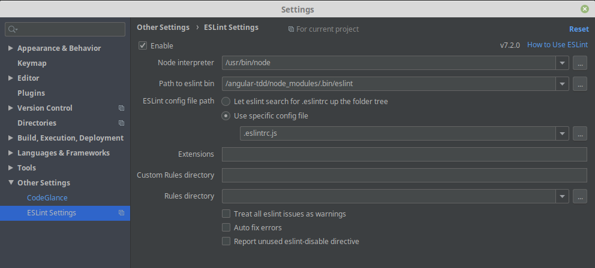

// settings:

:toc: macro
:toc-title: Sommaire
:toclevels: 2
:numbered:
:sectnumlevels: 2

ifndef::env-github[:icons: font]
ifdef::env-github[]
:status:
:outfilesuffix: .adoc
:caution-caption: :fire:
:important-caption: :exclamation:
:note-caption: :paperclip:
:tip-caption: :bulb:
:warning-caption: :warning:
endif::[]

// variables:

:uri-org: https://github.com/jprivet-dev
:uri-repo: {uri-org}/angular-tdd

:uri-rel-file-base: link:
:uri-rel-tree-base: link:
ifdef::env-site,env-yard[]
:uri-rel-file-base: {uri-repo}/blob/master/
:uri-rel-tree-base: {uri-repo}/tree/master/
endif::[]

:uri-license: {uri-rel-file-base}LICENSE

:BACK_TO_TOP_TARGET: top-target
:BACK_TO_TOP_LABEL: ⬆ Retour au sommaire
:BACK_TO_TOP: <<{BACK_TO_TOP_TARGET},{BACK_TO_TOP_LABEL}>>

[#{BACK_TO_TOP_TARGET}]
= Angular 9 & TDD

image:https://img.shields.io/github/license/jprivet-dev/angular-tdd[GitHub]

toc::[]

== L'installation (mémento)

=== Installer Node.js et NPM (Linux)

Voir https://medium.com/@shivraj.jadhav82/nodejs-and-npm-setup-on-linux-mint-19-696023d50247.

Vérifier les versions :

```sh
$ npm -v
$ node -v
```

Installer Node.js et NPM :

```sh
$ curl -sL https://deb.nodesource.com/setup_10.x | sudo -E bash -
$ sudo apt-get install -y nodejs
```

=== Mettre à jour NPM

```sh
$ npm install npm@latest -g
```

=== Installer Angular CLI

```sh
$ npm install -g @angular/cli
$ ng --version
```

=== Installer Yarn (Linux)

```sh
$ curl -sL https://dl.yarnpkg.com/debian/pubkey.gpg | sudo apt-key add -
$ echo "deb https://dl.yarnpkg.com/debian/ stable main" | sudo tee /etc/apt/sources.list.d/yarn.list
$ sudo apt-get update && sudo apt-get install yarn
$ yarn -v
```

=== Créer un projet (à la racine)

Générez votre projet :

```sh
$ ng new app --prefix app --defaults --directory ./
```

Et lancez le serveur dans la foulée :

```sh
$ ng serve
```

Puis allez sur http://localhost:4200/

CAUTION: Si vous souhaitez créer un projet à la racine, il ne faut pas qu'un fichier `README.md` y existe déjà, sinon vous aurez le message d'erreur suivant : `ERROR! README.md already exists.`

=== Linter & ESLint

==== Installation

```sh
$ yarn add --dev eslint eslint-config-google @typescript-eslint/{eslint-plugin,parser}
```

==== PHPStorm : configuration



== Ressources & Inspiration

=== TSLint & ESLint

* *Roadmap: TSLint -> ESLint* : https://github.com/palantir/tslint/issues/4534
* https://medium.com/create-code/migrate-angular-8-from-tslint-to-eslint-4b0c44c8ae38
* https://github.com/google/eslint-config-google

=== Badges

* https://shields.io/

{BACK_TO_TOP}

== Licence

{uri-repo} est publié sous {uri-license}[licence MIT].

{BACK_TO_TOP}
